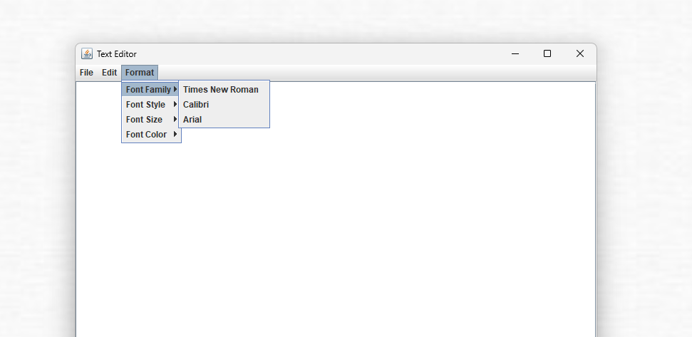

# Text Editor (Java Swing)

A simple text editor built in Java using Swing.  
This project demonstrates basic text editing functionality, including font formatting, color selection, and file operations.



---

## 📌 Features

- Open and save files in **TXT format** (`.txt`).
- Basic text operations: **Cut, Copy, Paste**.
- Popup menu support for quick editing.
- Text formatting:
    - **Font Family** (Times New Roman, Calibri, Arial)
    - **Font Style** (Regular, Bold, Italic, Bold Italic)
    - **Font Size** (8–72 via spinner)
    - **Font Color** (Black, Red, Green, Blue)
- Exit confirmation dialog to prevent accidental data loss.
- Fully GUI-based, built with **Java Swing**.

---

## 💻 Requirements

- **Java JDK 8 or higher**
- **IntelliJ IDEA** or any Java IDE
- Git (for version control, optional)

---

## 🚀 Getting Started

### 1. Clone the repository

```
git clone https://github.com/inc24/text-editor-java.git
cd text-editor-java
```

### 2. Open in IntelliJ IDEA

- Open IntelliJ IDEA.
- Select Open → Navigate to the project folder → Click OK.
- Let IntelliJ index the project.

### 3. Build and Run

- Run Main.java directly from IntelliJ IDEA:
  - Right-click Main.java → Run 'Main.main()'
  - Or use the green run button in the editor.

### 4. Usage

- Use File → Open to open a .txt file.
- Use File → Save / Save As to save your text.
- Use Edit menu or right-click popup for cut/copy/paste.
- Use Format menu to change font, size, style, and color.

---

## ⚙️ Project Structure

```
text-editor-java/
│
├─ src/
│   └─ Main.java        # Main application file
│
├─ screenshots/         # Optional: for README screenshots
│
├─ .gitignore           # Files and directories to ignore
│
└─ README.md
```

---

## 📌 Notes

The editor only saves plain text (.txt), formatting (font/color) is not preserved in files. 

Font size and style adjustments only affect the GUI editor.

---

## 👤 Author

- inc24 – [GitHub](https://github.com/inc24)

---